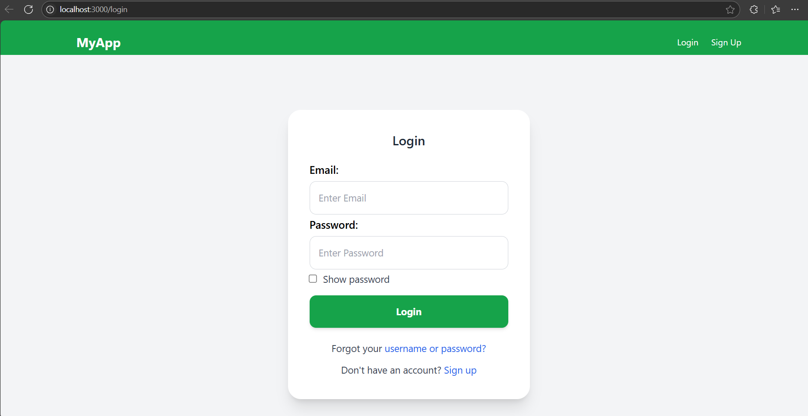

# 📝 To-Do App (Client)

This is the **frontend** part of a full-stack MERN To-Do application. It includes user authentication, dashboard for tasks, profile management, and a responsive UI using Tailwind CSS.

---

## 📸 Screenshot



---

## 🚀 Getting Started

### 1. Install dependencies

```bash
npm install
```

### 2. Start the development server

```bash
npm start
```

---

## ⚙️ Scripts

```bash
npm start       # Start dev server
npm build       # Build production version
npm test        # Run tests
npm eject       # Eject CRA config
```

---

## 🧰 Tech Stack & Dependencies

### 📦 Main Dependencies

- **React** `^19.1.0`
- **React Router DOM** `^7.6.0`
- **Axios** `^1.9.0`
- **JWT Decode** `^4.0.0`
- **React Icons** `^5.5.0`
- **Lucide React** `^0.510.0`
- **@heroicons/react** `^2.2.0`
- **React Scripts** `5.0.1`
- **Web Vitals** `^2.1.4`

### 🧪 Testing Libraries

- **@testing-library/react** `^16.3.0`
- **@testing-library/user-event** `^13.5.0`
- **@testing-library/dom** `^10.4.0`
- **@testing-library/jest-dom** `^6.6.3`

### 🎨 Styling

- **Tailwind CSS** `^3.4.17`
- **PostCSS** `^8.5.3`
- **Autoprefixer** `^10.4.21`

---

## 📂 Folder Structure

```
client/
├── public/
├── src/
│   ├── components/
│   ├── pages/
│   ├── services/
│   ├── hooks/
│   ├── App.js
│   ├── index.js
├── .env
├── package.json
├── tailwind.config.js
├── postcss.config.js
└── README.md
```

---

## 📄 License

This project is licensed under the **ISC License**.
